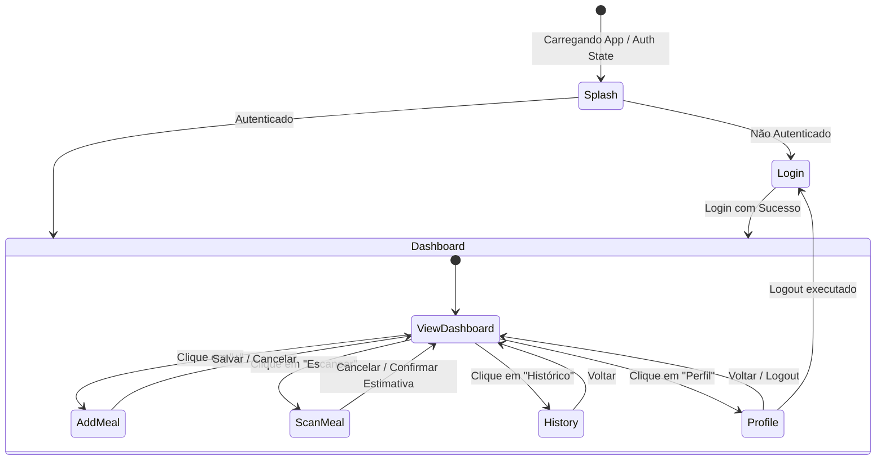

# Data Model: Integrando Expo Go (React Native)

Este documento descreve os modelos de dados e entidades compartilhados entre a Web e o Mobile no ProteinCheck.

## Entidades de Dados (Firestore / Compartilhado)

### 1. UserProfile (Perfil do Usuário)
Representa as informações antropométricas e objetivos nutricionais do usuário. Armazenado no Firestore sob a coleção `users/{uid}/profile`.

| Campo | Tipo | Descrição | Regras de Validação |
|---|---|---|---|
| `uid` | string | Identificador único do usuário no Firebase Auth | Obrigatório |
| `displayName` | string \| null | Nome de exibição do usuário | Opcional |
| `email` | string \| null | Email do usuário | Opcional |
| `photoURL` | string \| null | URL da imagem de perfil do usuário | Opcional |
| `weight` | number | Peso corporal em kg ou lb | Deve ser maior que 0. Valor padrão: 70 |
| `height` | number | Altura em cm | Deve ser maior que 0. Valor padrão: 170 |
| `proteinGoal` | number | Meta diária de consumo de proteínas em gramas | Calculado automaticamente se `autoCalculate` for true |
| `multiplier` | number | Multiplicador de proteínas com base no plano | Deve ser 1.2 (Manutenção), 1.6 (Ganho Leve) ou 2.0 (Desempenho) |
| `autoCalculate` | boolean | Define se a meta de proteínas é auto calculada | Padrão: true |
| `weightUnit` | 'kg' \| 'lb' | Unidade de peso | Padrão: 'kg' |
| `createdAt` | Timestamp | Data de criação do perfil | Obrigatório |

---

### 2. Meal (Registro de Refeição)
Representa um registro de alimento/refeição consumido pelo usuário. Armazenado no Firestore sob a coleção `users/{uid}/meals`.

| Campo | Tipo | Descrição | Regras de Validação |
|---|---|---|---|
| `id` | string (opcional) | ID do documento no Firestore | Opcional no cadastro |
| `name` | string | Descrição da refeição ou alimento | Obrigatório. Não pode ser vazio |
| `protein` | number | Quantidade de proteínas em gramas | Obrigatório. Deve ser maior ou igual a 0 |
| `timestamp` | Timestamp | Data/hora de consumo | Obrigatório |
| `imageUrl` | string (opcional)| Link da foto do prato enviada para escaneamento | Opcional |

---

## Estados Locais e Transições de Tela (Mobile)

### 3. Screen (Navegação Móvel)
Define a estrutura de rotas suportada pelo Expo Router no aplicativo móvel.

